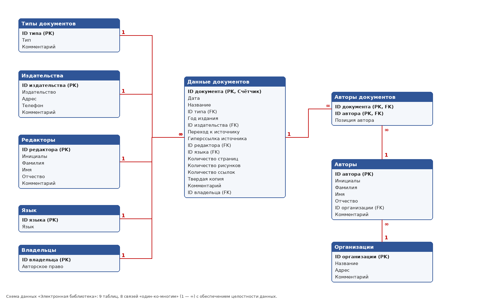

# База данных «Электронная библиотека» (Microsoft Access)

Файл: **`Электронная_библиотека.accdb`** — формат Access 2007 и новее (открывается в Access 2007/2010/2013/2016/2019/2021/365).

Структура сделана по учебнику (глава 2 «Планирование баз данных», таблицы 2.1–2.9): 9 таблиц, 8 связей
«один-ко-многим» с обеспечением целостности данных, 5 сохранённых запросов. В каждой таблице **не менее 15 записей**.

## Таблицы

| Таблица | Записей | Поля (тип) |
|---|---:|---|
| **Данные документов** | 24 | ID документа (Счётчик, ключ), Дата (Дата/время, по умолчанию `Date()`), Название (Текст, обязательное), ID типа, Год издания, ID издательства, Переход к источнику (имя файла — см. примечание), Гиперссылка источника (Гиперссылка), ID редактора, ID языка, Количество страниц, Количество рисунков, Количество ссылок, Твердая копия (MEMO), Комментарий (MEMO), ID владельца |
| **Авторы** | 34 | ID автора (Счётчик, ключ), Инициалы (Текст, 4 знака), Фамилия (обязательное), Имя, Отчество, ID организации, Комментарий (MEMO) |
| **Авторы документов** | 36 | ID документа + ID автора (составной ключ), Позиция автора (по умолчанию 1) |
| **Владельцы** | 16 | ID владельца (Счётчик, ключ), Авторское право |
| **Редакторы** | 16 | ID редактора (Счётчик, ключ), Инициалы (4 знака), Фамилия (обязательное), Имя, Отчество, Комментарий (MEMO) |
| **Издательства** | 23 | ID издательства (Счётчик, ключ), Издательство (обязательное, «город: название»), Адрес, Телефон, Комментарий (MEMO) |
| **Типы документов** | 18 | ID типа (Счётчик, ключ), Тип (обязательное), Комментарий (MEMO) |
| **Организации** | 20 | ID организации (Счётчик, ключ), Название (обязательное), Адрес, Комментарий (MEMO) |
| **Язык** | 16 | ID языка (Счётчик, ключ), Язык (обязательное) |

Для каждого поля в режиме конструктора заполнено «Описание» (текст из колонки «Примечание» учебника).

## Связи (Работа с базами данных → Схема данных)

`Язык`, `Типы документов`, `Издательства`, `Редакторы`, `Владельцы` → `Данные документов` (1:∞);
`Организации` → `Авторы` (1:∞); `Данные документов` → `Авторы документов` (1:∞); `Авторы` → `Авторы документов` (1:∞).
Все связи — с обеспечением целостности данных и каскадным обновлением связанных полей.

## Запросы (5)

| № | Запрос | Что показывает |
|---|---|---|
| 1 | Документы и их авторы | Соединение 4 таблиц; фамилия + инициалы автора в одном поле, позиция автора, год, издательство |
| 2 | Поиск документов по типу (параметр) | При открытии спрашивает «Введите тип документа» (можно часть слова: *учебник*, *статья*) |
| 3 | Количество документов по издательствам | Итоговый запрос: Count и Sum по группам, сортировка по убыванию |
| 4 | Издания после 2010 года | Условие отбора `Год издания >= 2010`, сортировка по году |
| 5 | Статистика публикаций по авторам | LEFT JOIN с организациями + группировка и Count |

Текст всех запросов на SQL — в файле `queries.sql`. Если какой-либо запрос понадобится пересоздать вручную:
**Создание → Конструктор запросов → закрыть «Добавление таблицы» → кнопка «SQL» → вставить текст → Ctrl+S**.

## Примечания

* Поле «Переход к источнику» в учебнике имеет тип «Вложение». Такое поле можно создать только средствами самого
  Access, поэтому в файле оно текстовое и содержит имя файла документа. При желании: откройте таблицу в конструкторе,
  добавьте новое поле типа «Вложение» и вложите файлы.
* При первом открытии Access может показать жёлтую панель «Предупреждение системы безопасности» — нажмите
  «Включить содержимое».
* Файл создан программно (скрипт `build_library_db.py`, библиотека Jackcess), поэтому окно «Схема данных» при первом
  открытии может быть пустым — нажмите «Все связи» на ленте, и таблицы появятся на схеме.
